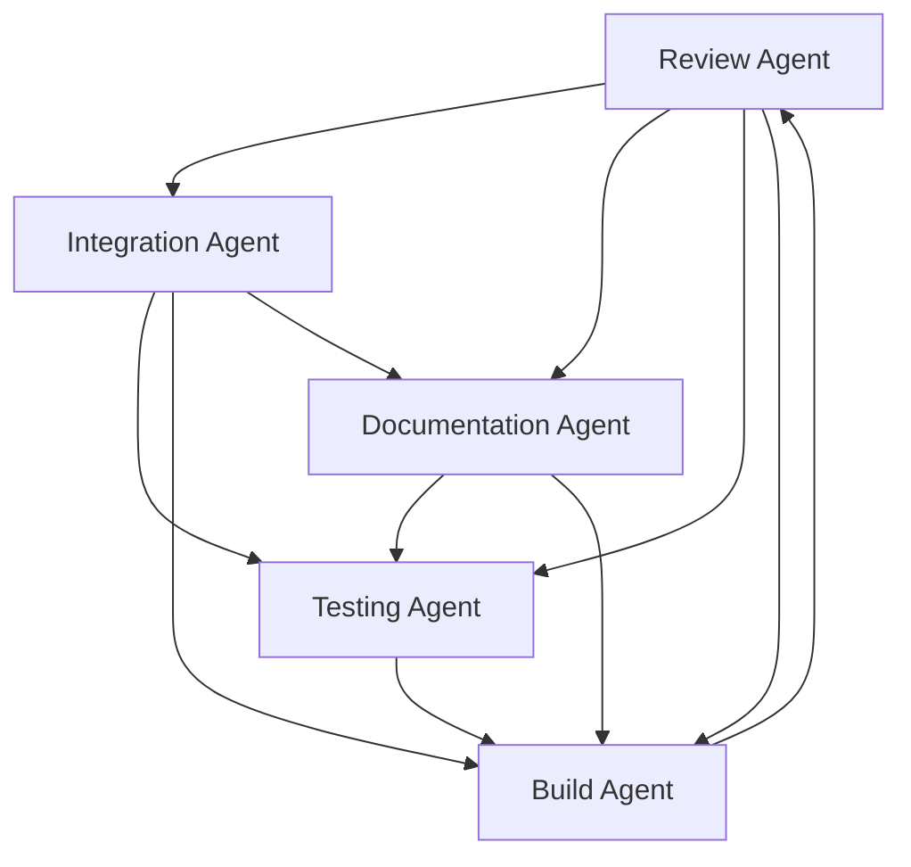

# 🎯 Agent Orchestration Configuration

## Multi-Agent Coordination for Civic Engagement Platform

This configuration defines how the specialized agents work together to accelerate development, maintain quality, and ensure successful delivery of the Civic Engagement Platform.

## Agent Interaction Matrix

### 🔄 Agent Dependencies and Workflows



## Coordinated Workflows

### 🚀 Feature Development Workflow

#### Phase 1: Requirements and Planning
1. **Documentation Agent** creates feature specification and requirements
2. **Review Agent** validates requirements for security and compliance
3. **Integration Agent** designs API and module integration points
4. **Testing Agent** creates test plan and acceptance criteria
5. **Build Agent** plans deployment and infrastructure requirements

#### Phase 2: Development
1. **Integration Agent** implements API endpoints and module connections
2. **Testing Agent** creates unit and integration tests
3. **Review Agent** performs ongoing code review and security analysis
4. **Documentation Agent** updates technical documentation
5. **Build Agent** updates CI/CD pipeline for new features

#### Phase 3: Quality Assurance
1. **Testing Agent** executes comprehensive test suite
2. **Review Agent** performs final security and quality review
3. **Integration Agent** validates cross-module functionality
4. **Documentation Agent** finalizes user guides and API docs
5. **Build Agent** prepares staging deployment

#### Phase 4: Deployment
1. **Build Agent** executes deployment pipeline
2. **Testing Agent** runs post-deployment validation
3. **Review Agent** monitors for security issues
4. **Integration Agent** verifies all integrations work correctly
5. **Documentation Agent** publishes release notes

### 🔧 Bug Fix Workflow

#### Immediate Response (< 1 hour)
1. **Review Agent** triages and classifies bug severity
2. **Testing Agent** creates reproduction test case
3. **Integration Agent** isolates affected systems

#### Investigation (1-4 hours)
1. **Review Agent** performs root cause analysis
2. **Integration Agent** identifies all affected components
3. **Testing Agent** expands test coverage for the bug area

#### Resolution (4-24 hours)
1. **Integration Agent** implements fix with minimal changes
2. **Review Agent** validates fix doesn't introduce new issues
3. **Testing Agent** verifies fix with comprehensive tests
4. **Documentation Agent** updates troubleshooting guides
5. **Build Agent** deploys fix through fast-track pipeline

### 🛡️ Security Incident Workflow

#### Detection (0-15 minutes)
1. **Review Agent** detects security vulnerability or incident
2. **Build Agent** immediately halts deployments if necessary
3. **Integration Agent** isolates affected systems

#### Assessment (15-60 minutes)
1. **Review Agent** performs comprehensive security assessment
2. **Testing Agent** creates security test cases
3. **Integration Agent** maps security impact across modules
4. **Documentation Agent** documents incident timeline

#### Remediation (1-8 hours)
1. **Integration Agent** implements security fixes
2. **Review Agent** validates all security measures
3. **Testing Agent** executes security test suite
4. **Build Agent** deploys security patches
5. **Documentation Agent** updates security documentation

## Agent Task Coordination

### 📋 Task Assignment Strategy

#### By Expertise Domain
```python
# Agent task routing based on expertise
class AgentTaskRouter:
    def route_task(self, task_type: str, task_details: dict) -> str:
        routing_map = {
            # Security and Quality
            'security_review': 'review-agent',
            'code_quality': 'review-agent',
            'vulnerability_assessment': 'review-agent',
            'performance_optimization': 'review-agent',
            
            # Integration and APIs
            'api_development': 'integration-agent',
            'module_integration': 'integration-agent',
            'database_migration': 'integration-agent',
            'external_service_integration': 'integration-agent',
            
            # Documentation
            'user_guide_creation': 'documentation-agent',
            'api_documentation': 'documentation-agent',
            'architecture_documentation': 'documentation-agent',
            'troubleshooting_guide': 'documentation-agent',
            
            # Testing
            'test_creation': 'testing-agent',
            'test_automation': 'testing-agent',
            'performance_testing': 'testing-agent',
            'security_testing': 'testing-agent',
            
            # Build and Deployment
            'ci_cd_pipeline': 'build-agent',
            'deployment_automation': 'build-agent',
            'environment_management': 'build-agent',
            'container_configuration': 'build-agent'
        }
        
        return routing_map.get(task_type, 'review-agent')  # Default to review
```

#### By Priority Level
```python
# Priority-based task assignment
class PriorityTaskManager:
    def assign_by_priority(self, task: dict) -> list:
        priority = task.get('priority', 'medium')
        task_type = task.get('type')
        
        if priority == 'critical':
            # All agents coordinate for critical issues
            return ['review-agent', 'integration-agent', 'testing-agent', 'build-agent']
        
        elif priority == 'high':
            if task_type in ['security', 'bug_fix']:
                return ['review-agent', 'testing-agent', 'build-agent']
            elif task_type in ['feature', 'enhancement']:
                return ['integration-agent', 'testing-agent', 'documentation-agent']
        
        elif priority == 'medium':
            # Standard single-agent assignment with review
            primary_agent = self.get_primary_agent(task_type)
            return [primary_agent, 'review-agent']
        
        else:  # low priority
            return [self.get_primary_agent(task_type)]
```

### 🔄 Cross-Agent Communication

#### Shared Context and State
```python
# Shared state management for agents
class AgentContextManager:
    def __init__(self):
        self.shared_context = {
            'current_sprint': None,
            'active_features': [],
            'security_alerts': [],
            'deployment_status': {},
            'test_results': {},
            'documentation_status': {}
        }
    
    def update_context(self, agent: str, context_type: str, data: dict):
        """Update shared context from any agent"""
        if context_type not in self.shared_context:
            self.shared_context[context_type] = {}
        
        self.shared_context[context_type].update({
            'agent': agent,
            'timestamp': datetime.now().isoformat(),
            'data': data
        })
        
        # Notify other agents of context changes
        self.notify_agents(agent, context_type, data)
    
    def get_context(self, context_type: str = None) -> dict:
        """Get shared context for all agents"""
        if context_type:
            return self.shared_context.get(context_type, {})
        return self.shared_context
    
    def notify_agents(self, source_agent: str, context_type: str, data: dict):
        """Notify relevant agents of context changes"""
        notification_rules = {
            'security_alert': ['review-agent', 'build-agent', 'integration-agent'],
            'test_failure': ['testing-agent', 'review-agent', 'integration-agent'],
            'deployment_status': ['build-agent', 'testing-agent', 'review-agent'],
            'api_change': ['integration-agent', 'documentation-agent', 'testing-agent']
        }
        
        relevant_agents = notification_rules.get(context_type, [])
        for agent in relevant_agents:
            if agent != source_agent:
                self.send_notification(agent, source_agent, context_type, data)
```

## Agent Specialization Guidelines

### 🎯 When to Use Each Agent

#### Review Agent - Use When:
- Security vulnerability needs assessment
- Code quality issues arise
- Performance bottlenecks are detected
- Architecture compliance validation needed
- Technical debt needs prioritization

#### Integration Agent - Use When:
- New API endpoints needed
- Cross-module integration required
- External service integration planned
- Database migration necessary
- Multi-platform compatibility needed

#### Documentation Agent - Use When:
- User guides need creation or updates
- API documentation is outdated
- Architecture changes require documentation
- Troubleshooting guides needed
- Onboarding materials required

#### Testing Agent - Use When:
- Test coverage is insufficient
- New testing strategies needed
- Performance testing required
- Security testing necessary
- Test automation needs improvement

#### Build Agent - Use When:
- CI/CD pipeline needs enhancement
- Deployment automation required
- Environment management needed
- Container configuration necessary
- Infrastructure changes planned

### 🔄 Agent Collaboration Patterns

#### Pattern 1: Sequential Collaboration
```
Documentation Agent → Integration Agent → Testing Agent → Review Agent → Build Agent
```
**Use Case**: New feature development with full lifecycle management

#### Pattern 2: Parallel Collaboration
```
Review Agent + Testing Agent + Integration Agent (simultaneously)
↓
Documentation Agent + Build Agent (after parallel phase)
```
**Use Case**: Critical bug fix requiring immediate attention

#### Pattern 3: Iterative Collaboration
```
Integration Agent ↔ Testing Agent ↔ Review Agent (cycle)
↓
Documentation Agent → Build Agent (finalization)
```
**Use Case**: Complex feature requiring multiple iterations

#### Pattern 4: Emergency Response
```
Review Agent (lead) → All Other Agents (coordinated response)
```
**Use Case**: Security incident or critical system failure

## Quality Gates and Handoffs

### 🚪 Quality Gates Between Agents

#### Review Agent → Integration Agent
- [ ] Security requirements validated
- [ ] Architecture compliance verified
- [ ] Performance requirements defined
- [ ] Code quality standards established

#### Integration Agent → Testing Agent
- [ ] API endpoints implemented and documented
- [ ] Module integration complete
- [ ] Integration test hooks available
- [ ] Test data and fixtures prepared

#### Testing Agent → Documentation Agent
- [ ] Test coverage above threshold (85%)
- [ ] All critical path tests passing
- [ ] Performance benchmarks met
- [ ] Security tests validated

#### Documentation Agent → Build Agent
- [ ] User documentation complete
- [ ] API documentation current
- [ ] Deployment guides updated
- [ ] Release notes prepared

#### Build Agent → Review Agent (feedback loop)
- [ ] Deployment successful
- [ ] Monitoring alerts configured
- [ ] Performance metrics within range
- [ ] Security scanning passed

### 📊 Success Metrics for Agent Coordination

#### Development Velocity
- Feature delivery time: Target < 2 weeks
- Bug fix time: Target < 24 hours for high priority
- Security patch time: Target < 4 hours for critical

#### Quality Metrics
- Code coverage: Target > 85%
- Security vulnerabilities: Target = 0 critical/high
- Documentation coverage: Target > 90%
- Test automation: Target > 95%

#### Collaboration Efficiency
- Cross-agent handoff time: Target < 2 hours
- Context sharing accuracy: Target > 95%
- Duplicate work incidents: Target < 5%
- Agent coordination overhead: Target < 10% of total time

## Agent Training and Knowledge Sharing

### 📚 Shared Knowledge Base
```python
# Shared knowledge management
class AgentKnowledgeBase:
    def __init__(self):
        self.knowledge_areas = {
            'security_patterns': {
                'owner': 'review-agent',
                'contributors': ['integration-agent', 'testing-agent'],
                'content': {}
            },
            'integration_patterns': {
                'owner': 'integration-agent', 
                'contributors': ['review-agent', 'testing-agent'],
                'content': {}
            },
            'testing_strategies': {
                'owner': 'testing-agent',
                'contributors': ['review-agent', 'integration-agent'],
                'content': {}
            },
            'deployment_procedures': {
                'owner': 'build-agent',
                'contributors': ['review-agent', 'integration-agent'],
                'content': {}
            },
            'documentation_standards': {
                'owner': 'documentation-agent',
                'contributors': ['all'],
                'content': {}
            }
        }
    
    def update_knowledge(self, area: str, agent: str, knowledge: dict):
        """Update shared knowledge from any agent"""
        if area in self.knowledge_areas:
            self.knowledge_areas[area]['content'].update(knowledge)
            self.knowledge_areas[area]['last_updated'] = {
                'agent': agent,
                'timestamp': datetime.now().isoformat()
            }
    
    def get_knowledge(self, area: str = None) -> dict:
        """Retrieve knowledge for agents"""
        if area:
            return self.knowledge_areas.get(area, {})
        return self.knowledge_areas
```

### 🎓 Agent Learning and Improvement
```python
# Continuous improvement for agent coordination
class AgentImprovementTracker:
    def track_coordination_metrics(self):
        """Track how well agents work together"""
        metrics = {
            'handoff_efficiency': self.measure_handoff_times(),
            'quality_gate_success': self.measure_quality_gates(),
            'communication_effectiveness': self.measure_communication(),
            'knowledge_sharing': self.measure_knowledge_sharing()
        }
        
        # Identify improvement opportunities
        improvements = self.identify_improvements(metrics)
        
        # Update agent configurations based on learnings
        self.update_agent_configs(improvements)
        
        return metrics, improvements
    
    def identify_improvements(self, metrics: dict) -> list:
        """Identify areas for agent coordination improvement"""
        improvements = []
        
        if metrics['handoff_efficiency'] < 0.8:
            improvements.append({
                'area': 'handoff_process',
                'recommendation': 'Implement automated handoff notifications',
                'priority': 'high'
            })
        
        if metrics['quality_gate_success'] < 0.9:
            improvements.append({
                'area': 'quality_gates',
                'recommendation': 'Add more specific quality criteria',
                'priority': 'medium'
            })
        
        return improvements
```

This Agent Orchestration Configuration ensures that all specialized agents work together effectively, creating a powerful development ecosystem that accelerates the Civic Engagement Platform's evolution while maintaining high quality and security standards.